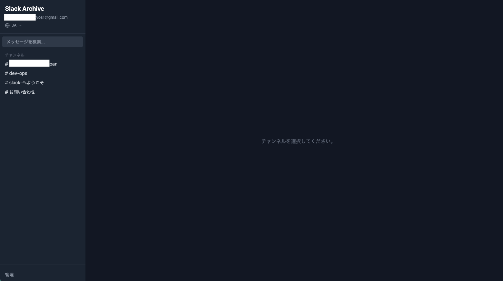
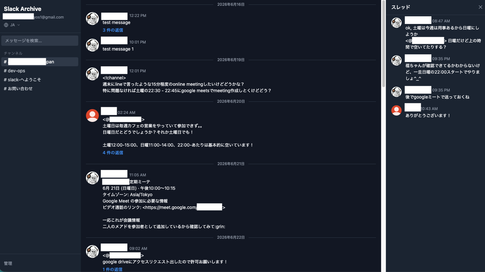
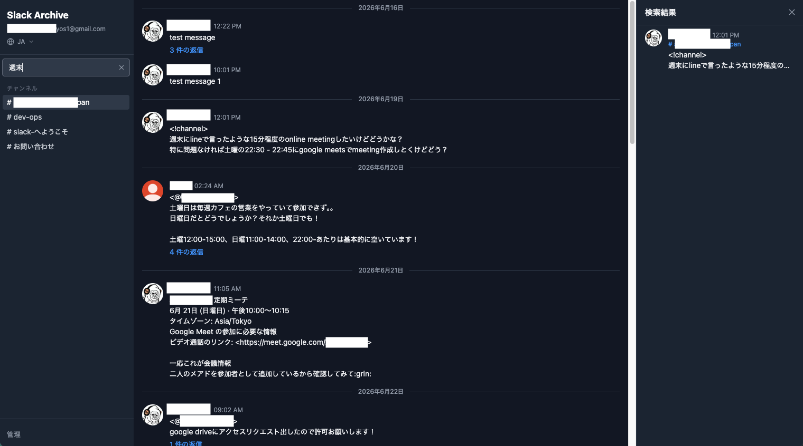
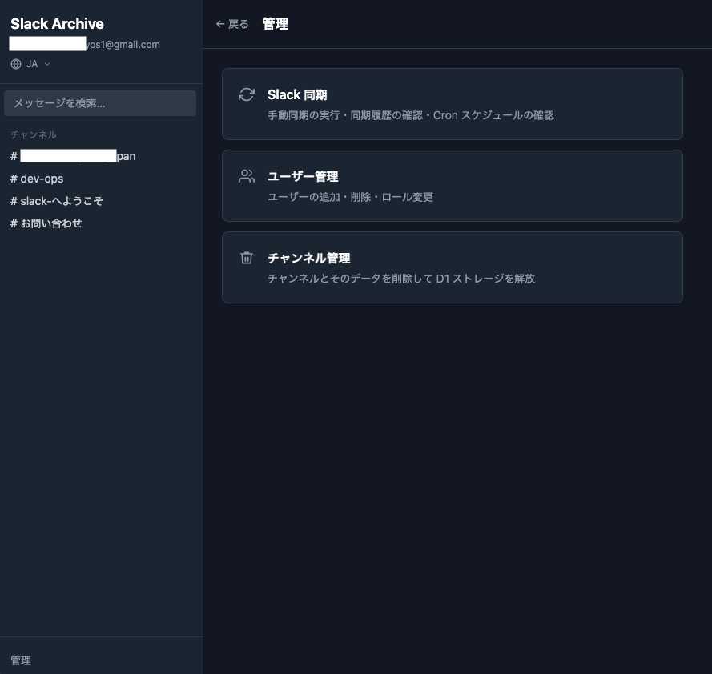
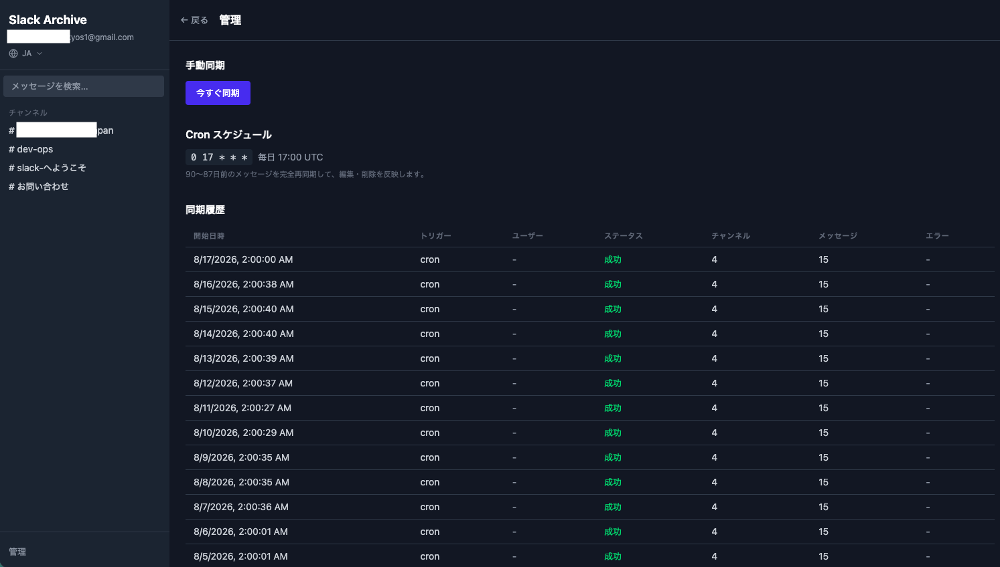
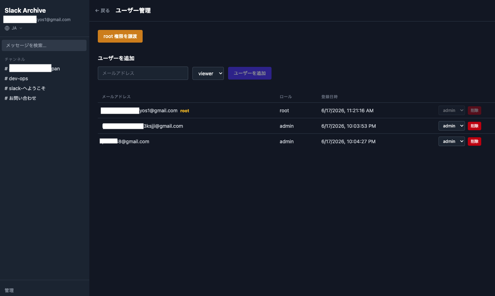
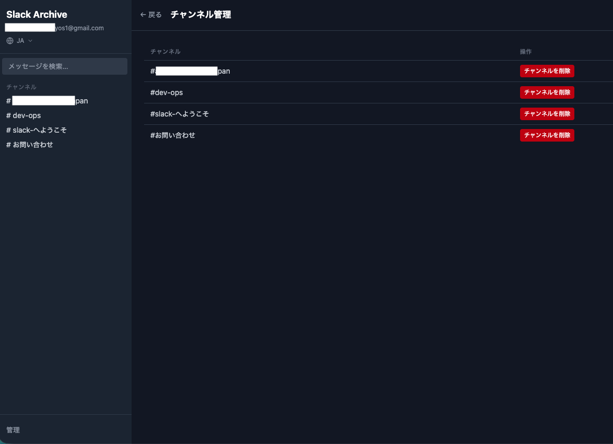

# slack-archive

Slack無料プランの90日制限を超えて、チームの会話履歴を永続的に保存・閲覧できる自前アーカイブシステム。

Slack APIでメッセージ・チャンネル・ユーザー情報を定期的に同期し、Cloudflare D1に保存する。Slackライクな UI でチャンネル一覧・メッセージ履歴・スレッドを閲覧できる。

## 技術スタック

- Cloudflare Workers (with Static Assets) + [Hono](https://hono.dev)
- Cloudflare D1 + Drizzle ORM
- React 19 + Vite
- Cloudflare Access（Google IdP）による認証、`users` テーブルの role による認可
- Slack API (`@slack/web-api`)

詳細な設計は [`docs/initial-plan/`](./docs/initial-plan/) を、運用手順は [`docs/ops/`](./docs/ops/) を参照。

## スクリーンショット

### メッセージ閲覧

| チャンネル一覧 | メッセージ・スレッド |
|---|---|
|  |  |

### 横断検索



### 管理画面（/management）

| メニュー | Slack 同期 |
|---|---|
|  |  |

| ユーザー管理 | チャンネル管理 |
|---|---|
|  |  |

## セットアップ

### 前提

- Node.js
- Cloudflareアカウント
- Slack App（Bot Token: `channels:read`, `channels:history`, `channels:join`, `users:read` スコープ）

### 手順

```bash
git clone <this-repo>
cd slack-archive
cp .dev.vars.example .dev.vars   # DEV_USER_EMAIL, SLACK_BOT_TOKEN 等を設定
make setup                       # npm install + ローカル D1 マイグレーション + wrangler types
make dev                         # 開発サーバー起動
```

初回のみ、`.dev.vars` に `DEV_USER_EMAIL` を設定した状態で `make init-setup-local` を実行するとローカル D1 に root ユーザーが自動投入される。

本番デプロイ手順（D1 作成、Cloudflare Access 設定、secrets 登録等）は [`docs/ops/production-setup.md`](./docs/ops/production-setup.md) を参照。

### よく使うコマンド

| コマンド | 内容 |
|---------|------|
| `make dev` | 開発サーバー起動 |
| `make check` | format + lint + typecheck + test + build |
| `make db-reset-local` | ローカル D1 を破棄して再構築 |
| `make deploy` | Cloudflare Workers へデプロイ |
| `make help` | コマンド一覧表示 |

## License

[MIT](./LICENSE)
